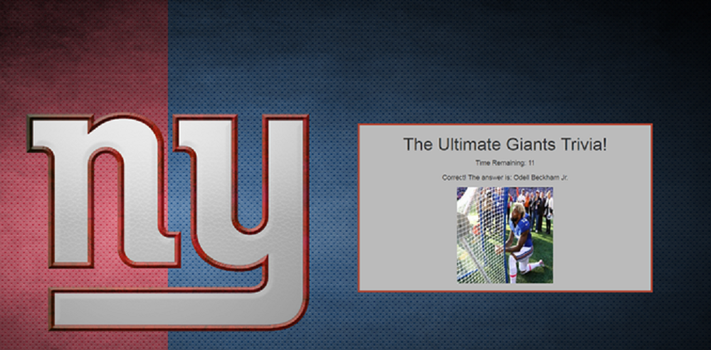

# NYGiantsTrivia
This is a NY Giants trivia game. This app was built out with HTML, CSS, Javascript, and Jquery.

## Playing the game

1.) On page load you will be brought to the home screen. If you click on the kickoff button it will launch the trivia game.

2.) Once the trivia game starts you will have 15 seconds to answer each question. Each question will be answered by clicking the answer you believe to correct.

3a.) If you answer correctly you will receive a screen letting you know that you answered correctly with an image of the correct answer. The next question will display after 3 seconds.

3b.) If you answer incorrectly you will receive a screen letting you know the answer was wrong with an image of an X. The next question will display after 3 seconds.

3c.) If you let the timer run out you will receive a screen letting you know time has expired with a times up! Image. The next question will display after 3 seconds.

4.) Once all the questions have been answered a final screen will appear. This will display the final results from the trivia game. After 5 seconds the game will start over.

# Technologies Used
* HTML
* CSS
* Bootstrap
* Javascript
* Jquery
